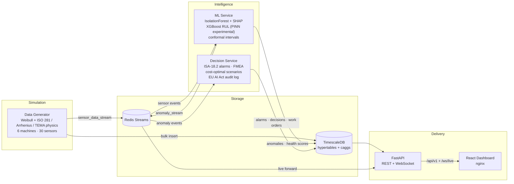

# PDM Intelligence — Industrial AI Predictive Maintenance

[](../../actions/workflows/ci.yml)
[](LICENSE)
[](https://www.python.org/)
[](https://react.dev/)

An end-to-end predictive-maintenance platform for a simulated six-machine factory:
physics-based sensor simulation → real-time ML anomaly detection → cost-optimal
decision scenarios → ISA-18.2 alarm management → operator dashboard. One
`docker compose up` brings up the entire pipeline.

> **Live demo:** [pdm.muratsuer.eu](https://pdm.muratsuer.eu) — open a machine page and inject a fault to watch the closed loop respond end-to-end.

<!-- SCREENSHOT: Fleet Overview dashboard -->
<!-- SCREENSHOT: Decision Center with cost-optimal scenarios -->

## What makes this different

Most PdM demos draw random numbers and call them predictions. This project does not:

- **Physics-grounded simulation.** Machine degradation follows Weibull reliability
  models calibrated to IEEE 493; sensors degrade through ISO 281 bearing-life,
  Arrhenius oil-oxidation, TEMA fouling and CEMA belt-tension models, with AR(1)
  noise matched to each sensor's physical inertia. Line A failures cascade load
  onto Line B.
- **Honest ML discipline.** Purged k-fold cross-validation with embargo
  (leak-proof temporal splits), split-conformal prediction intervals for RUL with
  distribution-free coverage guarantees, an experimental physics-informed neural
  network (built and tested, not yet on the live inference path) whose loss
  enforces Weibull mean-life boundary conditions and RUL monotonicity, SHAP
  attributions computed per anomaly, and model cards with SHA256 artifact hashes.
- **Operations-grade decision layer.** ISA-18.2 alarm state machine with alarm-flood
  suppression (R-010), a 12-mode FMEA library with RPN scoring, cost-optimal
  scenario generation (observe / reduce load / planned / shutdown) driven by
  lognormal survival probabilities, and an EU AI Act Article 14 audit trail for
  every automated decision.
- **Real plumbing.** TimescaleDB hypertables with compression and continuous
  aggregates, Redis Streams between services, FastAPI + WebSocket live feed,
  React 19 dashboard — the whole stack comes up from a single `docker compose`.
  CI runs ruff, the full unit suite, the production frontend build, and a
  docker-compose smoke test that boots the whole stack and checks the API
  answers end to end through the frontend proxy.

## Architecture



The factory: two production lines, each with a rotary air compressor (AC), a
shell-and-tube heat exchanger (HX) and a conveyor drive (CM). Compressor outlet
pressure feeds the heat exchanger; a Line A failure shifts +40 % load onto
Line B's conveyor — and the decision engine prices that cascade into its
recommendations.

## Quick start

```bash
git clone <repo-url> && cd pdm-intelligence
cp .env.example .env          # adjust POSTGRES_PASSWORD at minimum
docker compose up -d
```

Then open **http://localhost** (or `HTTP_PORT` from your `.env`):

- `/` — live dashboard (fleet, machine detail, decision center, audit trail)
- `/docs` — interactive OpenAPI documentation
- `/ws/live` — WebSocket feed (fleet snapshots every 5 s + anomaly events)

The simulation runs at 10× wall-clock by default (`SIMULATION_SPEED`), which
keeps the fleet calm: machines degrade over real days, organic failures are
occasional, and the demo is driven by the fault-injection controls on each
machine page (detection → alarm → decision → maintenance in a few minutes).
Raise the speed (e.g. `SIMULATION_SPEED=500`) to compress a full machine life
into ~17 minutes instead. With `DECISION_DEMO_MODE=true` a virtual operator
auto-approves stale decisions, so the demo keeps moving even with nobody at
the controls.

## The decision loop

1. ML confirms an anomaly over consecutive cycles (no single-spike alarms) and
   classifies the fault from SHAP attributions + sensor patterns.
2. The decision engine generates five costed scenarios (observe / dispatch
   technician / reduce load / planned / shutdown). `REDUCE_LOAD` is only offered
   while wear-out dominates (Weibull β > 1); `SHUTDOWN` stays on the table even
   when survival margin is thin — flagged urgent rather than hidden, because
   excluding it once left "keep watching" as the cheapest option on a machine
   about to fail.
3. The operator approves a scenario in the dashboard — or the watchdog
   auto-approves the AI recommendation when the response window expires
   (ISA-18.2 escalation).
4. Every step lands in the audit trail: who decided, what the AI recommended,
   whether the human overrode it, and the response time — per EU AI Act
   Article 14 human-oversight requirements.

## Development

```bash
# Backend
pip install -e .[api,ml,test]
pytest tests/unit -q            # 1,424 tests
ruff check src scripts tests

# Frontend
cd frontend
npm ci
npm run dev                     # proxies /api and /ws to localhost:8000
```

Run individual services against local PostgreSQL/Redis:

```bash
python scripts/init_db.py                  # idempotent schema + seed
python -m src.data_generator.runner        # physics simulation → Redis + DB
python -m src.ml.subscriber                # anomaly detection + RUL
python -m src.decision.runner              # alarms + decision scenarios
uvicorn src.api.app:app --reload           # REST + WebSocket API
```

## Project structure

```
src/
├── data_generator/   # Weibull engine, sensor physics, async simulation engine
├── ml/               # detectors, RUL (XGBoost; PINN experimental), conformal, SHAP, evaluation/
├── decision/         # ISA-18.2 state machines, FMEA library, cost engine, audit
├── api/              # FastAPI routers, WebSocket live feed, Pydantic schemas
└── database/         # SQLAlchemy models (TimescaleDB), connection management
frontend/             # React 19 + TypeScript + Tailwind dashboard
alembic/              # schema migrations
scripts/init_db.py    # idempotent DB initializer (hypertables, caggs, seeds)
tests/unit/           # 1,424 tests across all layers
docs/                 # FMEA worksheets, O&M manuals, maintenance database
```

## Simulated human oversight (EU AI Act note)

This system is **not** marketed as autonomous. In a real deployment a human
operator reviews and approves every decision (EU AI Act Article 14 human
oversight). Because nobody continuously staffs the public demo, that human is
*simulated*: if no decision arrives within the response window (~3 minutes
+/-20%), the on-shift operator bot with the required authority level approves
the AI recommendation through the exact same resolution chain a human would
use.

- Authority limits: actions under EUR 500 are approved at OPERATOR rank,
  under EUR 2 000 at SUPERVISOR rank, above that at MANAGER rank.
- Identities: each rank is staffed per shift (`BOT-OPR/SUP/MGR x
  ALPHA/BRAVO/CHARLIE`); a real visitor acts as `HUMAN-OP-1`.
- Accountability: the audit trail records exactly who - human or which bot -
  made every decision, what the AI recommended, and whether it was overridden.

The savings KPI compares each completed maintenance against its recorded
run-to-failure counterfactual (emergency repair premium, extended reactive
downtime, cascade losses, collateral stress) - the figure the system is
designed to avoid.

## Honest limitations

This is a portfolio system trained on simulated data — and it says so:

- Models are calibrated against the physics simulation, not production sensors.
  Model cards record this explicitly, along with training windows and artifact
  hashes.
- Weibull parameters come from IEEE 493 reliability tables (demo-scaled 0.2× so
  failures occur within days, not months); real equipment needs fitting against
  actual failure history.
- Conformal RUL intervals carry their stated coverage guarantee only once enough
  failure residuals accumulate; cold-start predictions fall back to a labelled
  Weibull estimate (`method: weibull_fallback`).
- Fault *classification* is a rule-based signature library (weighted
  sensor-threshold rules per machine type), not a learned classifier. It names a
  fault only above a confidence threshold and deliberately leaves ambiguous or
  early-stage anomalies `UNCLASSIFIED` rather than guessing — over a recent
  multi-day run roughly 40 % were unclassified at decision time. That is by
  design: an unidentified anomaly that keeps recurring is escalated to a
  technician inspection (`DISPATCH_TECHNICIAN`) instead of being watched
  indefinitely or mislabelled.
- The API ships without authentication — appropriate for a read-mostly demo
  behind a reverse proxy, not for production.

## Author

**Murat SÜER** — environmental engineer (15 years in engineering & occupational
safety) turned data scientist. This project sits where those two careers meet:
the FMEA worksheets, ISA/ISO/TEMA references and alarm-management workflows come
from industrial practice; the ML pipeline comes from the new one.

[muratsuer.eu](https://muratsuer.eu) · murat@muratsuer.eu

Licensed under [Apache-2.0](LICENSE).
